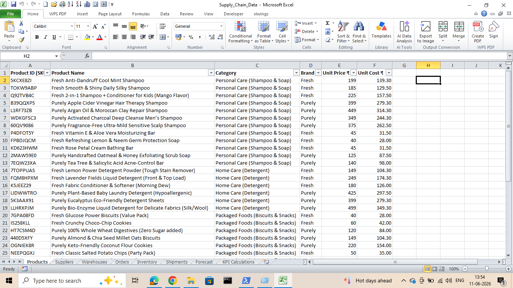
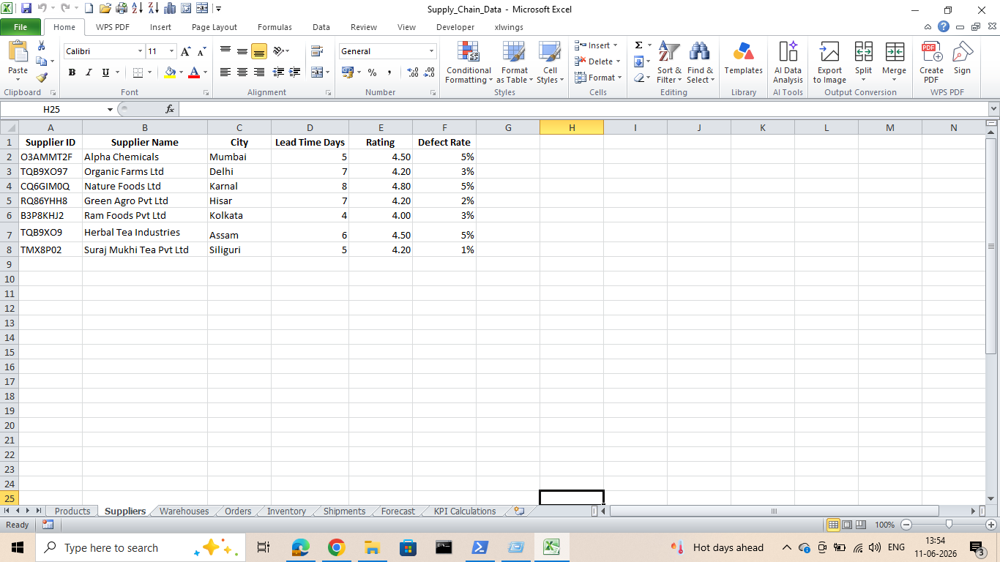
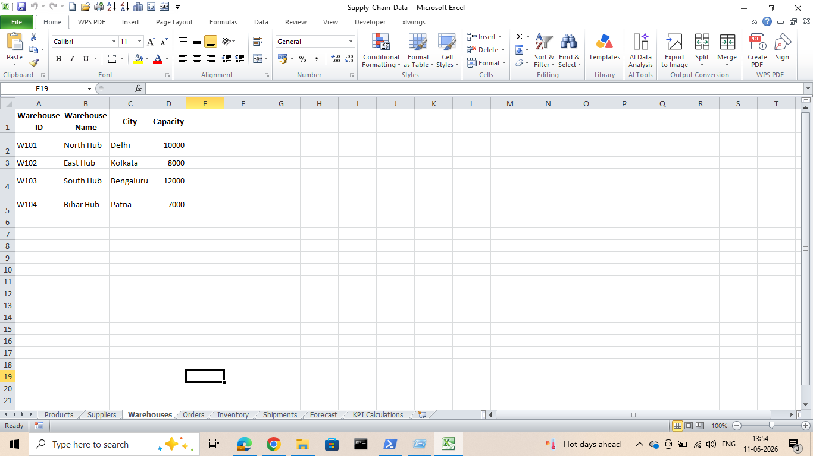
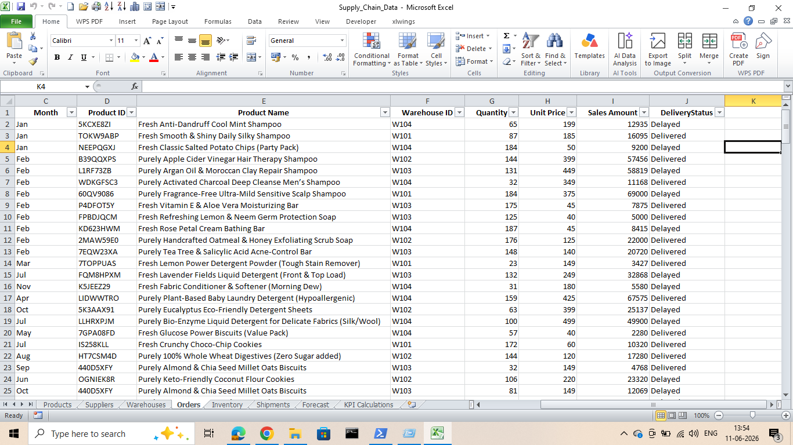
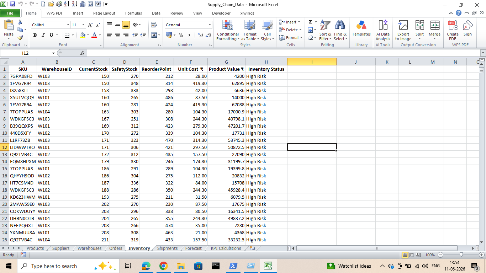
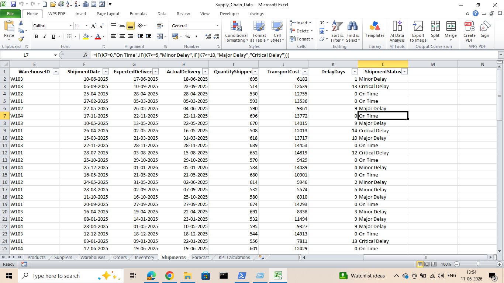
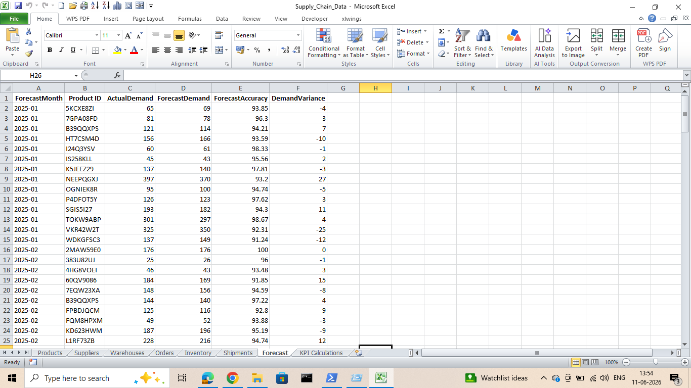
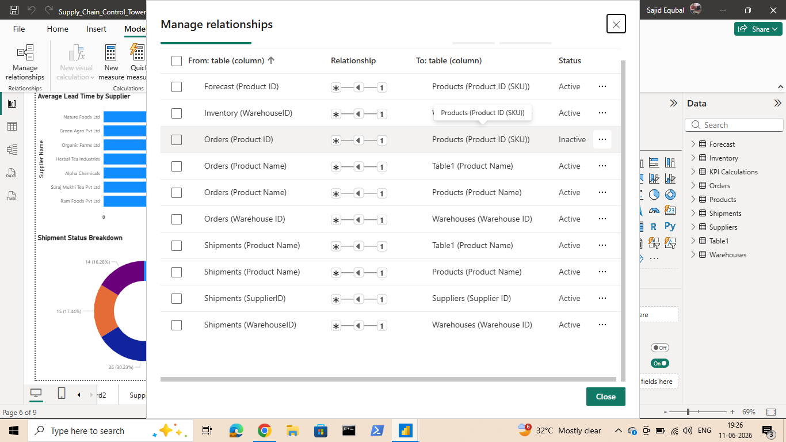

# Supply-Chain-Control-Tower-Dashboard
End-to-end Supply Chain Control Tower built with Power BI, Python, Excel, DAX, and Power Query for inventory, supplier, shipment, and demand forecasting analytics.

  

🚒 **Supply Chain Control Tower Dashboard**

📌 **Project Overview** 

 I developed an end-to-end Supply Chain Control Tower using Microsoft Power BI, Excel, Python, DAX, and Power Query.

This solution was designed to provide visibility into sales performance, inventory management, supplier reliability, shipment tracking, and demand forecasting. The analysis identifies operational bottlenecks and highlights opportunities to improve supply chain performance through data-driven decision-making.

🎯 **Business Problem**

Many organizations experience challenges such as:

Shipment delays
Supplier performance issues
Inventory stockout risks
Inaccurate demand planning
Limited visibility across supply chain operations

To address these challenges, a centralized Supply Chain Control Tower was developed to monitor critical KPIs and provide actionable insights for management.

🛠️ **Tools & Technologies**
&bull;Microsoft Power BI

&bull;Microsoft Excel

&bull;Python

&bull;Pandas

&bull;OpenPyXL

&bull;DAX (Data Analysis Expressions)

&bull;Power Query

&bull;Data Modeling

&bull;Business Intelligence Reporting

📂** Dataset Structure**

The dataset was designed to simulate a real-world FMCG supply chain environment.

**Products**

&bull;ProductID

&bull;Product Name

&bull;Category

&bull;Brand

&bull;Unit Price

&bull;Unit Cost

  

**Suppliers**

&bull;SupplierID

&bull;Supplier Name

&bull;Lead Time, Days

&bull;Rating

&bull;Defect Rate

  

**Warehouses**

&bull;WarehouseID

&bull;Warehouse Name

&bull;City

&bull;Capacity

  

**Orders**

&bull;Month

&bull;Product ID

&bull;Product Name

&bull;Warehouse ID

&bull;Quantity

&bull;Unit Price

&bull;Sales Amount

&bull;Delivery Status

  

**Inventory**

&bull;SKU ID

&bull;Warehouse ID

&bull;Current Stock

&bull;Safety Stock

&bull;Reorder Point

&bull;Unit Cost

&bull;Product Cost

&bull;Inventory Status

  

**Shipments**

&bull;Warehouse ID

&bull;Shipment Date

&bull;Expected Delivery

&bull;Actual Delivery 

&bull;Quantity Shipped

&bull;Transport Cost

&bull;Delay Days

&bull;Shipment Status

  

**Forecast**

&bull;Forecast Month

&bull;Product ID

&bull;Actual Demand

&bull;Forecast Demand

&bull;Forecast Accuracy 

&bull;Demand Variance

  

The project dataset is stored in the Excel workbook below.

### View Dataset

[Open Supply Chain Dataset](Supply_Chain_Data.xlsx)

🐍** Python Demand Forecasting Automation**

Before developing the Forecast Dashboard, a Python-based forecasting workflow was implemented to automate demand forecasting and KPI generation.

Forecasting Workflow
👉Step 1: Historical Order Extraction

Historical sales transactions were extracted from the Orders dataset.

👉Step 2: Data Preparation

The following preprocessing steps were performed:

Converted order dates into datetime format
Created monthly forecasting periods
Prepared demand history for aggregation
👉Step 3: Demand Aggregation

Monthly demand was calculated by grouping order quantities by Product ID and Forecast Month.

👉Step 4: Forecast Generation

Forecast demand values were generated using controlled demand variation within ±10% of actual demand.

👉Step 5: Forecast KPI Calculation

The script calculated:

Actual Demand
Forecast Demand
Forecast Accuracy
Demand Variance
👉Step 6: Automated Excel Integration

The generated forecast dataset was automatically written back to the Forecast worksheet using OpenPyXL.

**Outcome**

The forecasting process produced a forecast accuracy of 95.07%, demonstrating a high level of alignment between forecasted and actual demand.

### View Notebook

[Open Python Forecasting Notebook](supplychain.ipynb)

🔗 **Data Model**

A star-schema data model was implemented to improve reporting efficiency and analytical performance.

**Relationships**

Suppliers → Products → Orders

Products → Inventory

Products → Forecast

Warehouses → Orders

Warehouses → Inventory

Warehouses → Shipments

  

**Benefits**

The data model provides:

&bull; Faster report performance

&bull; Simplified relationship management

&bull; Accurate KPI calculations

&bull; Improved dashboard responsiveness

📖 **Business Story**

As a Supply Chain Analyst, I developed a Supply Chain Control Tower to investigate operational challenges across inventory, suppliers, shipments, and demand planning.

The analysis revealed that demand forecasting was highly accurate (95.07%), indicating that the company could predict customer demand effectively. However, service-level performance remained weak, with only 49% OTIF and more than 50% of orders experiencing delays.

By analyzing supplier performance, shipment reliability, and inventory health, I identified supplier delays and inventory stockout risks as the primary drivers of poor delivery performance. Nearly 39% of SKUs were classified as high risk, while only 36% of shipments arrived on time.

The dashboard provides decision-makers with a centralized view of supply chain operations and highlights opportunities to improve supplier performance, optimize inventory levels, and increase overall service reliability.

## 📊 Power BI Dashboard

The Power BI dashboard was developed to provide a centralized Supply Chain Control Tower for monitoring operational performance across sales, inventory, suppliers, shipments, and demand forecasting.

### Dashboard Pages

#### Executive Dashboard

* Revenue Analysis
* Order Performance
* OTIF Monitoring
* Delivery Performance
* Revenue by Brand and Category

  

  

#### Inventory Dashboard

* Inventory Value Tracking
* High-Risk SKU Identification
* Stockout Risk Analysis
* Current Stock vs Reorder Point Monitoring

#### Supplier Dashboard

* Supplier Performance Evaluation
* Lead Time Analysis
* Shipment Status Monitoring
* Delay Analysis by Supplier

#### Forecast Dashboard

* Actual vs Forecast Demand
* Forecast Accuracy Tracking
* Demand Variance Analysis
* Product-Level Forecast Performance

### Key Features

* Interactive slicers and filters
* KPI monitoring
* Inventory risk tracking
* Supplier performance analysis
* Shipment performance monitoring
* Demand forecasting insights
* Dynamic dashboard navigation

### Skills Demonstrated

* Power BI Development
* Data Modeling
* DAX Measures
* Power Query
* Dashboard Design
* KPI Development
* Business Intelligence Reporting

### Power BI File

Supply_Chain_Control_Tower.pbix

### View Dashboard File

[Open Power BI Dashboard](Supply_Chain_Control_Tower.pbix)

